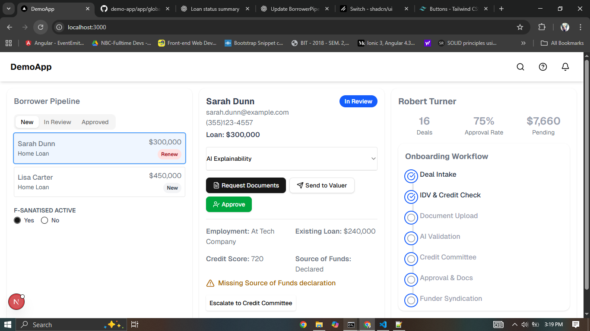

# demo-app

DemoApp

A modern dashboard built with Next.js, Tailwind CSS, and shadcn/ui.
It includes onboarding workflows, broker overview, AI assistant toggle, and Cypress integration tests.

Features

Broker Overview — summary cards (deals, approval rate, pending amounts)

Onboarding Workflow — step tracker from intake to syndication

AI Assistant Toggle — enable/disable “E Ardsassist” with a switch

Cypress Tests — end-to-end coverage for workflows, API mocks, and UI behavior

Custom Theme — Tailwind + CSS variables with light/dark mode support

1. Install dependencies

npm install

# or

yarn install

2. Run the dev server

npm run dev

3. Run Cypress tests

npx cypress open  
npx cypress run

Tech Stack

Framework: Next.js

Styling: Tailwind CSS + shadcn/ui

State Management: Zustand

Testing: Cypress

Type Safety: TypeScript

API Endpoints (Mocked for Cypress)

GET /api/broker/1 → Returns broker details

GET /api/onboarding/workflow → Returns workflow steps

